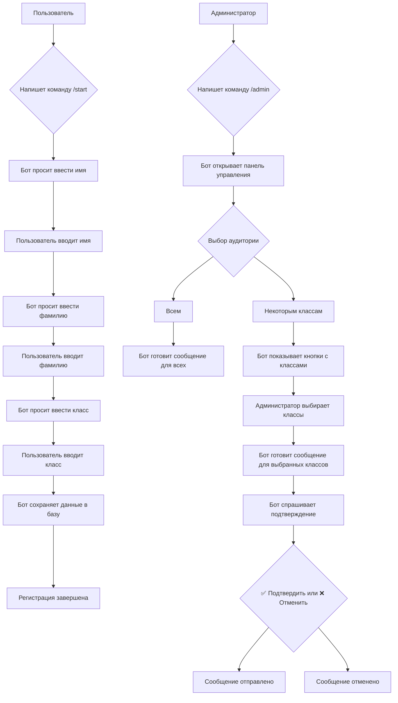

```mermaid
graph TD
    A[Пользователь] --> B{Напишет команду /start}
    B --> C[Бот просит ввести имя]
    C --> D[Пользователь вводит имя]
    D --> E[Бот просит ввести фамилию]
    E --> F[Пользователь вводит фамилию]
    F --> G[Бот просит ввести класс]
    G --> H[Пользователь вводит класс]
    H --> I[Бот сохраняет данные в базу]
    I --> J[Регистрация завершена]

    K[Администратор] --> L{Напишет команду /admin}
    L --> M[Бот открывает панель управления]
    M --> N{Выбор аудитории}
    N --> O[Всем]
    N --> P[Некоторым классам]
    O --> Q[Бот готовит сообщение для всех]
    P --> R[Бот показывает кнопки с классами]
    R --> S[Администратор выбирает классы]
    S --> T[Бот готовит сообщение для выбранных классов]
    T --> U[Бот спрашивает подтверждение]
    U --> V{✅ Подтвердить или ❌ Отменить}
    V --> W[Сообщение отправлено]
    V --> X[Сообщение отменено]
```
