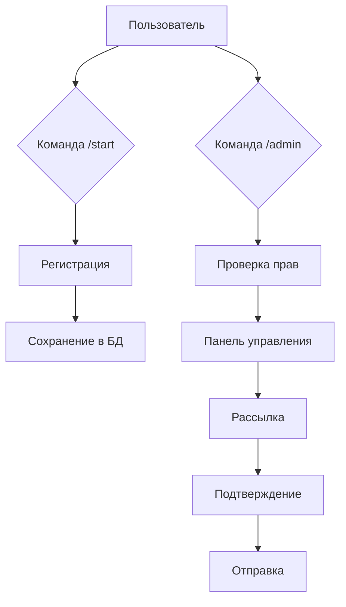

```mermaid
graph TD
    A[Пользователь] --> B{Команда /start}
    B --> C[Регистрация]
    C --> D[Сохранение в БД]
    A --> E{Команда /admin}
    E --> F[Проверка прав]
    F --> G[Панель управления]
    G --> H[Рассылка]
    H --> I[Подтверждение]
    I --> J[Отправка]
```
